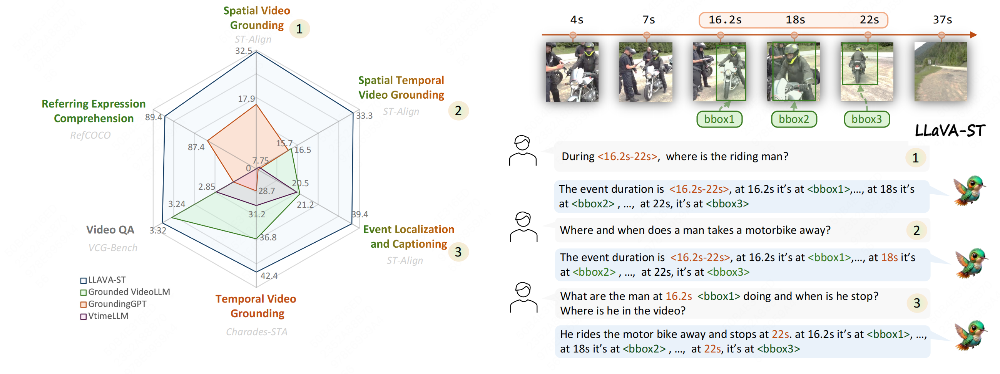
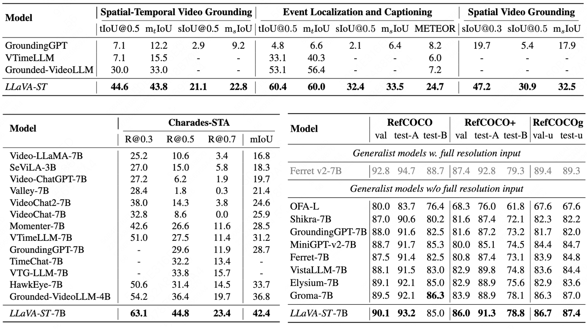

<p align="center">

</p>

# LLaVA-ST: A Multimodal Large Language Model for Fine-Grained Spatial-Temporal Understanding

[Hongyu Li](https://scholar.google.com/citations?user=PccL82sAAAAJ&hl=en), [Jinyu Chen](https://scholar.google.com/citations?user=9v4HaLEAAAAJ&hl=en&oi=ao)\*, Ziyu Wei\*, [Shaofei Huang](https://scholar.google.com/citations?user=hVbSuo0AAAAJ&hl=en&oi=ao), [Tianrui Hui](https://scholar.google.com/citations?user=ArjkrTkAAAAJ&hl=en&oi=ao), [Jialin Gao](https://scholar.google.com/citations?user=sj4FqEgAAAAJ&hl=en&oi=ao), [Xiaoming Wei](https://scholar.google.com/citations?user=JXV5yrZxj5MC&hl=en&oi=ao), [Si Liu](https://scholar.google.com/citations?user=-QtVtNEAAAAJ&hl=en&oi=ao)

-----

<a href='#'></a>
<a href='https://arxiv.org/abs/xxxx.xxxxx'></a> 
<!-- <a href='#'></a>  -->

<!-- <a href='https://huggingface.co/LLaVA-ST'></a> 
<a href='https://huggingface.co/datasets/LLaVA-ST/ST-Align'></a>  -->

This repository will provide the details and code for our model, dataset, and benchmark for LLaVA-ST, a model designed for fine-grained spatial-temporal multimodal understanding.

-----------

## 📰 News
* **[2025.01.15]** 📄 Our paper is now available on [Arxiv](https://arxiv.org/abs/xxxx.xxxxx).

## 📝 Abstract

Recent advancements in multimodal large language models (MLLMs) have shown promising results, yet existing approaches struggle to effectively handle both temporal and spatial localization simultaneously. 
This challenge stems from two key issues: first, incorporating spatial-temporal localization introduces a vast number of coordinate combinations, complicating the alignment of linguistic and visual coordinate representations; second, encoding fine-grained temporal and spatial information during video feature compression is inherently difficult.
To address these issues, we propose <strong>LLaVA-ST</strong>, a MLLM for fine-grained spatial-temporal multimodal understanding.
Our innovations include Language-Aligned Positional Embedding and the Spatial-Temporal Packer.
Furthermore, we propose [ST-Align dataset]() with 4.3M training samples for fine-grained spatial-temporal multimodal understanding.
With ST-Align dataset, we present a progressive training pipeline that aligns the visual and textual feature through sequential coarse-to-fine stages. Additionally, we introduce an [ST-Align benchmark]() to evaluate spatial-temporal interleaved fine-grained understanding tasks. Our method achieves outstanding performance on 11 benchmarks requiring fine-grained temporal, spatial, or spatial-temporal interleaving multimodal understanding.

## 😲 First MLLM with Spatial-Temporal Fine-Grained Understanding Capacity


<p align="center">

</p>

<p align="center">

</p>

LLaVA-ST demonstrates high performance across various tasks of fine-grained multimodal understanding and is the first
MLLM capable of simultaneously processing spatial-temporal fine-grained understanding tasks.

<!-- ## 📝 Citation
```bibtex

``` -->