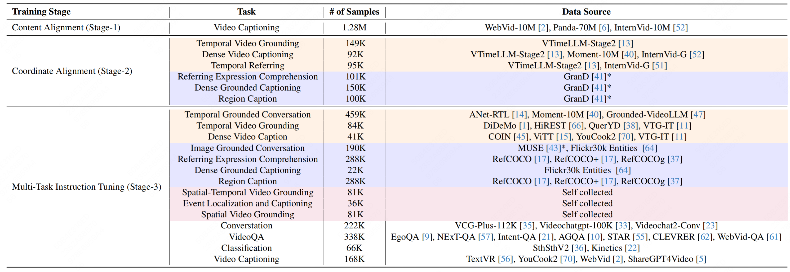

<p align="center">

</p>

# LLaVA-ST: A Multimodal Large Language Model for Fine-Grained Spatial-Temporal Understanding

[Hongyu Li](https://scholar.google.com/citations?user=PccL82sAAAAJ&hl=en), [Jinyu Chen](https://scholar.google.com/citations?user=9v4HaLEAAAAJ&hl=en&oi=ao)\*, [Ziyu Wei](https://scholar.google.com/citations?hl=en&user=cKny1EMAAAAJ)\*, [Shaofei Huang](https://scholar.google.com/citations?user=hVbSuo0AAAAJ&hl=en&oi=ao), [Tianrui Hui](https://scholar.google.com/citations?user=ArjkrTkAAAAJ&hl=en&oi=ao), [Jialin Gao](https://scholar.google.com/citations?user=sj4FqEgAAAAJ&hl=en&oi=ao), [Xiaoming Wei](https://scholar.google.com/citations?user=JXV5yrZxj5MC&hl=en&oi=ao), [Si Liu](https://scholar.google.com/citations?user=-QtVtNEAAAAJ&hl=en&oi=ao)

-----

<a href='#'></a>
<a href='https://arxiv.org/abs/2501.08282'></a> <a href='https://huggingface.co/appletea2333/LLaVA-ST-Qwen2-7B'></a>
<a href='https://huggingface.co/datasets/appletea2333/ST-Align-Dataset'></a> <a href='https://huggingface.co/datasets/appletea2333/ST-Align-Benchmark'></a> 
<!-- <a href='#'></a>  -->


This repository provide the details and code for model, dataset, and benchmark for LLaVA-ST, a model designed for fine-grained spatial-temporal multimodal understanding.

-----------

## 📰 News
* **[2025.01.15]** 📄 Our paper is now available on [arXiv](https://arxiv.org/abs/2501.08282).
* **[2025.02.27]** 🎉 Our paper has been accepted by CVPR 2025! 
* **[2025.07.05]** 🎉 Release our [code](https://github.com/appletea233/LLaVA-ST), [model](https://huggingface.co/appletea2333/LLaVA-ST-Qwen2-7B), [benchmark](https://huggingface.co/datasets/appletea2333/ST-Align-Benchmark), and [datasets](https://huggingface.co/datasets/appletea2333/ST-Align-Dataset).


## 📝 Abstract

Recent advancements in multimodal large language models (MLLMs) have shown promising results, yet existing approaches struggle to effectively handle both temporal and spatial localization simultaneously.
This challenge stems from two key issues: first, incorporating spatial-temporal localization introduces a vast number of coordinate combinations, complicating the alignment of linguistic and visual coordinate representations; second, encoding fine-grained temporal and spatial information during video feature compression is inherently difficult.
To address these issues, we propose <strong>LLaVA-ST</strong> , a MLLM for fine-grained spatial-temporal multimodal understanding.
Our innovations include Language-Aligned Positional Embedding and the Spatial-Temporal Packer.
Furthermore, we propose [ST-Align dataset](https://huggingface.co/datasets/appletea2333/ST-Align-Dataset) with 4.3M training samples for fine-grained spatial-temporal multimodal understanding.
With ST-Align dataset, we present a progressive training pipeline that aligns the visual and textual feature through sequential coarse-to-fine stages. Additionally, we introduce an [ST-Align benchmark](https://huggingface.co/datasets/appletea2333/ST-Align-Benchmark) to evaluate spatial-temporal interleaved fine-grained understanding tasks. Our method achieves outstanding performance on 11 benchmarks requiring fine-grained temporal, spatial, or spatial-temporal interleaving multimodal understanding.

## 😲 First MLLM with Spatial-Temporal Fine-Grained Understanding Capacity


<p align="center">

</p>

<p align="center">

</p>

LLaVA-ST demonstrates high performance across various tasks of fine-grained multimodal understanding and is the first
MLLM capable of simultaneously processing spatial-temporal fine-grained understanding tasks.

## ST-Align Dataset

<p align="center">

</p>
Overview of ST-Align dataset. Tasks highlighted in orange involve datasets on temporal fine-grained understanding; those in blue pertain to spatial fine-grained understanding; and those in pink correspond to spatiotemporal interleaved fine-grained understanding.

To obtain the data, please visit [ST-Align-Dataset](https://huggingface.co/datasets/appletea2333/ST-Align-Dataset) and organize the source files according to the paths specified in the 3 stage YAML files which can be find in [ST-Align-Dataset](https://huggingface.co/datasets/appletea2333/ST-Align-Dataset).

## ST-Align Benchmark
We introduce an [ST-Align Benchmark](https://huggingface.co/datasets/appletea2333/ST-Align-Benchmark) to evaluate spatial-temporal interleaved fine-grained understanding tasks including Spatial-Temporal Video Grounding (STVG), Spatial Video Grounding (SVG) and Event Localization and Captioning. 


For evaluation, please visit the [ST-Align-Benchmark](https://huggingface.co/datasets/appletea2333/ST-Align-Benchmark) and organize the data into the format required by `inference/config.yaml`.

## Install
### 1. Clone this repository and navigate to the project folder:
```bash
git clone https://github.com/appletea233/LLaVA-ST
cd LLaVA-ST
```

### 2. Install the packages:
```bash
conda create -n llava-st python=3.10 -y
conda activate llava-st
pip install --upgrade pip  # Enable PEP 660 support.
pip install -e ".[train]"
```

## Train

Please check the scripts under `scripts/train` and set the training hyperparameters. The scripts correspond to the three stages: Content Alignment, Coordinate Alignment, and Multi-Task Instruction Tuning, respectively.

```bash
bash scripts/train/train_stage1.sh
bash scripts/train/train_stage2.sh
bash scripts/train/train_stage3.sh
```

## Inference and Evaluate
### Inference
Run `inference/inference_all.sh` to automatically inference finegrained spatial temporal understanding benchmarks on all available gpus, including:
* REC on refcoco, refcoco+ and refcocog benchmark
* TVG on charades_sta benchmark
* STVG, SVG, ELC on ST-Align benchmark
```bash
bash inference/inference_all.sh
```
Parameter settings:
* `MODEL_PATH`: model path/base model path (when lora exists)
* `LORA_PATH` : lora path, if there are multiple loras, fill in the paths in order, separated by spaces
* `save_dir` : path to save inference results
* `sub_dir` : sub directory for saving inference results
### Evaluate
Evaluate performance on all benchmarks using inference results
```bash
bash inference/eval_all.sh
```

## Demo 

Please refer to `demo/readme.md` for a quick visualization of each task on examples, including REC, REG, TVG, STVG, SVG, SVG, DGC, etc.

### Visualization

#### Spatial Temporal Video Grounding (STVG)
<p align="center">

</p>

#### Spatial Video Grounding (SVG)
<p align="center">

</p>

#### Event Localization and Captioning (ELC)
<p align="center">

</p>

#### Temporal Video Grounding (TVG)
<p align="center">

</p>

#### Temporal Referring (TR)
<p align="center">

</p>

####  Referring Expression Comprehension and Region Caption (REC, REG)
<p align="center">

</p>

####  Dense Grounded Captioning (DGC)
<p align="center">

</p>


## 📝 Citation
```bibtex
@misc{li2025llavastmultimodallargelanguage,
      title={LLaVA-ST: A Multimodal Large Language Model for Fine-Grained Spatial-Temporal Understanding},
      author={Hongyu Li and Jinyu Chen and Ziyu Wei and Shaofei Huang and Tianrui Hui and Jialin Gao and Xiaoming Wei and Si Liu},
      year={2025},
      eprint={2501.08282},
      archivePrefix={arXiv},
      primaryClass={cs.CV},
      url={https://arxiv.org/abs/2501.08282},
}
```
